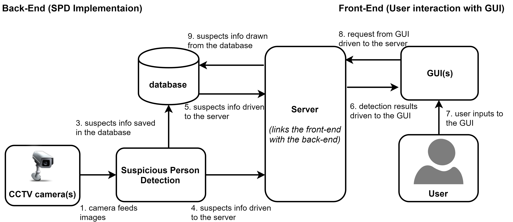

# Real Time Detection of a Suspicious Person in CCTV Footage

## Abstract

Since the need of security, surveillance and control systems have been deployed all over the world. However these systems needs human factor for supervision. In automated video surveillance applications, detection of suspects is of great practical importance to help prevent crimes in a better way. However due to the large diversity of nature of suspects in different scenarios, reliable classification of a suspicious person can be very difficult. Defining an approach to the problem of automated detection of unusual or suspicious persons in CCTV videos which will best fit in most of the scenarios is our primary aim. 

This work represents a novel technique for the automated detection of a suspicious person at the time of crime scene in a CCTV footage installed in indoor/outdoor environments like entrances, exits of buildings, corridors etc. Any person holding a weapon is considered to be a suspicious person for this work. Our work presents a framework that processes live video data obtained from a CCTV camera fixed at a particular location.

## Project Design

Due to the complexity of the design, we have divided the system into three main parts:

1. the front-end GUI for input and output operations 
1. the back-end which is the actual implementation of the SPD and 
1. the server which allows the front-end and the back-end to communicate with each others and acts as a linker for the two clients. 

The interaction between different modules is shown below:

## About Repository
This repo contains two sub-directories:

1. Angular_GUIs contains the GUIs (desktop application) which is connected to backend via websockets along with the server implementation
1. Python_Implementation is the back-end implementation of Suspicious Person Detection in Python connected with the front-end GUIs
